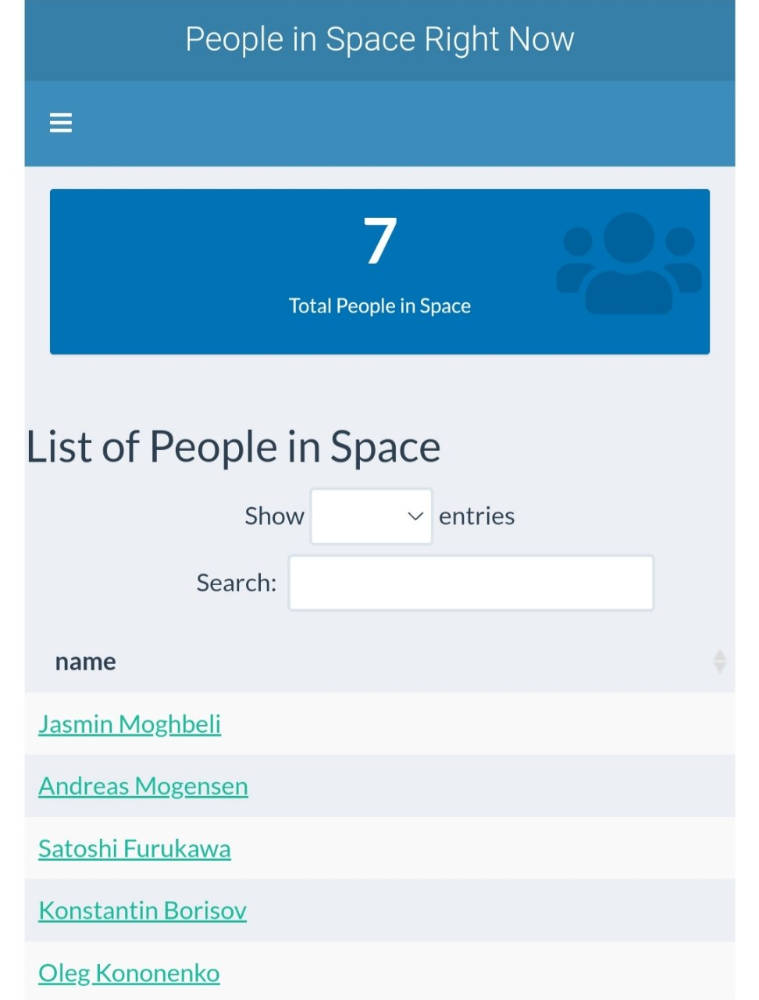
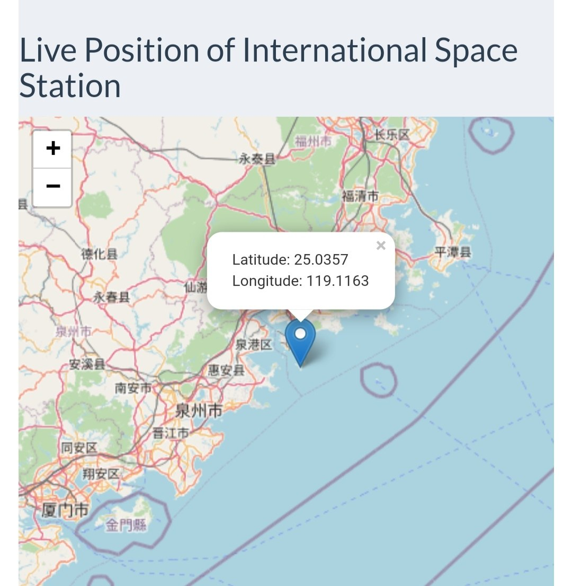

# People in Space Explorer 🚀

Welcome to the People in Space Explorer – a dynamic R Shiny app that provides real-time information about astronauts currently in space and the live position of the International Space Station (ISS). Explore the cosmos interactively and learn more about the incredible individuals working beyond our planet.


## Data Source

The data for this app is sourced from [Open Notify API](http://api.open-notify.org/). It provides live information about the people currently in space and the live position of the International Space Station (ISS).

## Features

- **Live ISS Position Map:** Visualize the current location of the ISS on an interactive map.
- **Astronaut List with Wikipedia Links:** Browse a list of astronauts on the ISS with hyperlinks to their Wikipedia pages for more details.
- **Responsive Design:** The app is designed for a seamless experience on various devices.

## Live Demo

Explore the app live on [shinyapps.io](https://arun-gopinath.shinyapps.io/People_space_now/).

## Getting Started

1. Clone the repository:

   ```bash
   git clone https://github.com/arungop/People-in-Space-Explorer.git
   ```

2. Install required packages:

   ```R
   install.packages(c("shiny", "leaflet", "shinythemes", "httr", "jsonlite"))
   ```

3. Run the app:

   ```R
   library(shiny)
   runApp("app_directory")
   ```

## Screenshots




## Contributing

Contributions are welcome! Feel free to submit issues or pull requests.

## About the Developer

Hi there! 👋 I'm [Arun Gopinathan](https://arungopinathan.com), a passionate space enthusiast and developer. Connect with me on [LinkedIn](https://www.linkedin.com/in/aungopinat/) to explore more exciting projects.

## License

This project is licensed under the MIT License - see the [LICENSE](LICENSE) file for details.

---

**Ready to embark on a cosmic journey?** 🚀✨

